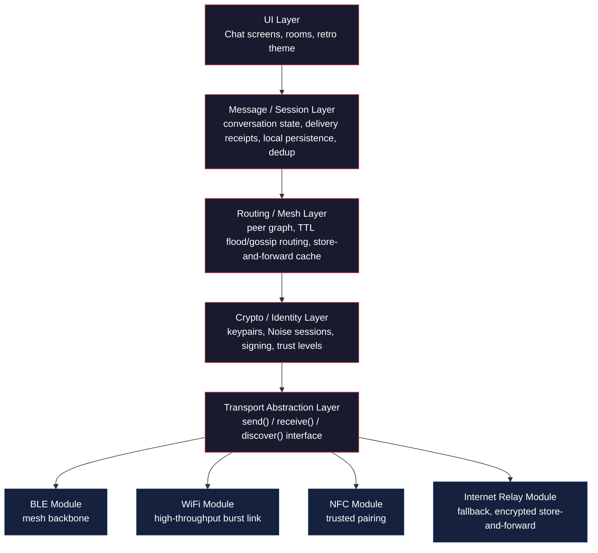
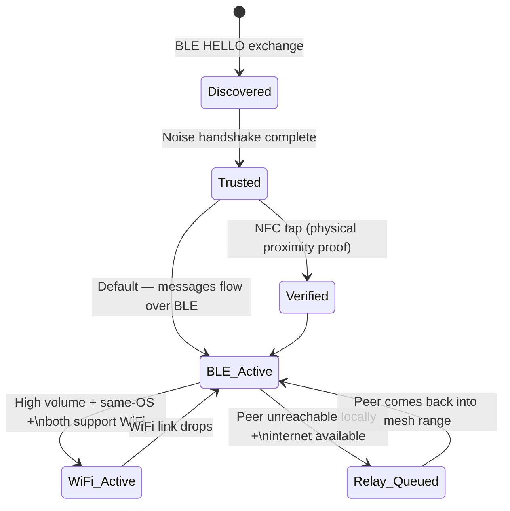

# Squelch — Product & Technical Specification
### *"When someone's near, the static clears."*

**Version:** 0.1 (Draft for build)
**Type:** Native mobile app (iOS + Android), text-only chat
**Core idea:** Decentralized, serverless, encrypted mesh chat over Bluetooth LE, WiFi (Direct/Aware), and NFC — with internet as a fallback relay, not a dependency.

---

## 1. Vision & Design Principles

Squelch is offline-first messaging for proximity and community use: festivals, protests, campuses, disaster zones, subways — anywhere internet is absent, censored, or unreliable. No phone numbers, no accounts, no central server that can see who's talking to whom.

**Design principles:**
1. **Offline is the default, not the fallback.** The app must be fully usable with zero internet.
2. **No accounts, no phone numbers, no emails.** Identity = a locally-generated cryptographic keypair.
3. **Transports are invisible to the user.** The user just sees "connected" / "message sent" — BLE vs WiFi vs NFC vs internet relay is an implementation detail, surfaced only in a debug/status view.
4. **Text only.** No images, no files, no voice — keep payloads tiny, keep the mesh fast, keep the product focused.
5. **Retro appeal.** Visual and interaction language borrows from BBS systems, IRC clients, old Nokia SMS, terminal UIs, and 90s AIM — monospace type, chunky pixel accents, CRT-ish flourishes — but the UX underneath must feel modern and intuitive, not gimmicky or hard to use.
6. **Ephemeral by default.** Messages live on-device only; there is no cloud archive. (Configurable local history, see §6.3.)
7. **Engaging, not just functional.** Beyond chat, lightweight turn-based "door games" (§8) — a direct callback to classic BBS door games — give people a reason to open the app even before they have someone to talk to, and reuse the same encrypted, store-and-forward pipe chat already relies on.

---

## 2. High-Level Architecture

### 2.1 Layered stack



Every layer above "Transport Abstraction" is transport-agnostic. This is the most important architectural rule: **routing, crypto, and UI never know or care which radio carried a byte.**

### 2.2 Message flow across the mesh (example: A → C, no direct link)

```mermaid
sequenceDiagram
    participant A as Device A
    participant B as Device B (relay hop)
    participant C as Device C

    Note over A,C: A and C are out of direct range;<br/>B is in range of both (BLE mesh)

    A->>A: Compose message, sign with Ed25519, encrypt (Noise session w/ C)
    A->>B: Broadcast packet (MsgID, TTL=6, SenderPK, Sig, Payload) over BLE
    B->>B: Check MsgID (unseen) → decrement TTL → cache briefly
    B->>C: Re-broadcast packet over BLE
    C->>C: Verify signature, decrypt with session key
    C-->>B: ACK (hop-by-hop)
    B-->>A: ACK (hop-by-hop)
    Note over A,C: If C is unreachable, B stores the<br/>encrypted packet and forwards later<br/>when it next sees C's identity (store-and-forward)
```

### 2.3 Transport negotiation (per-peer session)



---

## 3. Identity & Cryptography

- On first launch, generate an **Ed25519 signing keypair** (identity) and an **X25519 keypair** (key exchange), stored in the platform secure enclave / keystore (iOS Keychain, Android Keystore).
- Display identity as a short human-readable fingerprint (e.g., 4 retro-styled "call sign" words derived from the pubkey hash — reinforces the retro CB-radio / ham-radio vibe: `"ECHO-4X9K"`).
- **Session encryption:** Noise Protocol Framework, `Noise_XX` pattern for peers meeting for the first time over BLE/WiFi (mutual authentication without prior trust), and `Noise_KK` for peers who've already exchanged keys via NFC (both parties already know each other's static key, so pairing is near-instant and stronger-trust).
- **Message signing:** every message is signed by the sender's Ed25519 key so forwarding nodes (in multi-hop mesh) can't tamper with content, only relay it.
- **Forward secrecy:** rotate Noise session keys periodically (e.g., every N messages or T minutes) per active peer session.
- **Trust levels** (surfaced subtly in UI, e.g., a colored glyph next to a contact):
  - 🟢 **Verified** — paired via NFC tap (physical proximity proof).
  - 🟡 **Met** — key exchanged over BLE/WiFi without physical tap.
  - 🔴 **Relayed** — first contact came via internet relay, no proximity proof at all.

- **Uniqueness note:** the public key — not the call-sign — is the actual unique identifier used for routing, addressing, and trust. Call-signs are a human-friendly display derived from a hash of the pubkey, purely for the UI; the protocol never uses them to disambiguate peers. This matters because it's what makes serverless identity work at all — there's no central registry handing out IDs, so every device must be able to mint its own unique, unforgeable one, and does so locally at first launch.

- **Call-sign collision handling (UI requirement):** because call-signs are a shortened hash, it's possible (rare, but not impossible in a large mesh) for two *different* public keys to produce the same displayed call-sign. The UI must never merge or conflate two entries just because their call-signs match — each contact/blip is keyed internally by full public key. When a collision is detected, disambiguate visually, e.g., append a short suffix to one or both displayed call-signs (`ECHO-4X9K` / `ECHO-4X9K#2`), or show the fuller pubkey fingerprint on tap. This should be handled automatically the moment a collision is detected in the local peer/contact list — never silently.

---

## 4. Transport Layer Details

### 4.1 Bluetooth LE — the mesh backbone
- Always-on background scanning + advertising using a dedicated service UUID.
- Role: peer discovery, presence/heartbeat, small message delivery (text messages are small — BLE is sufficient for the vast majority of chat traffic).
- iOS: CoreBluetooth, with `bluetooth-central` + `bluetooth-peripheral` background modes declared; must re-advertise on state restoration.
- Android: BLE GATT server + client, run inside a **foreground service** with a persistent notification (required on modern Android to keep scanning alive); respect Android 12+ runtime BLE permissions.
- MTU negotiation: request larger MTU (up to 512 bytes on Android, ~185 on iOS) to reduce fragmentation of chat packets.

### 4.2 WiFi (Direct on Android / peer-to-peer on iOS via MultipeerConnectivity's WiFi channel or WiFi Aware where available)
- Role: burst upgrade path when BLE would be slow — e.g., a room with many active peers exchanging lots of small messages, or when BLE link quality is poor. Text messages rarely need this, but keep it as a throughput/reliability upgrade path and a home for future features.
- Negotiate WiFi connection **only after** BLE has already established peer identity and trust — WiFi is never the first-contact transport (higher power cost, slower discovery, less universally backgroundable).
- Cross-OS caveat: Android WiFi Direct and iOS's P2P frameworks are not interoperable. For cross-platform pairs, treat WiFi as same-OS-only optimization; BLE remains the guaranteed cross-platform path.

### 4.3 NFC — trusted pairing, not messaging
- Role: tap-to-pair. Two devices tapped together exchange static public keys instantly over NFC (very short range = physical proximity proof), which:
  - Skips manual safety-number verification.
  - Immediately upgrades the peer's trust level to 🟢 Verified.
  - Can optionally carry a tiny signed "intro" payload (e.g., "Hi, I'm ECHO-4X9K") but never carries ongoing chat messages.
- iOS: Core NFC (reader mode; iOS cannot do peer-to-peer NFC writes the way Android can — plan for asymmetric handling, e.g., Android can host an NDEF payload that iOS reads).
- Android: Android Beam-successor approach — NDEF push/read via `NfcAdapter`.

### 4.4 Internet Relay — fallback only, built on Nostr (Phase 2)

**Decision: use the public Nostr relay network rather than operating our own server.** This keeps internet mode genuinely free to run and host, forever — no infra bill for the team, no single point of failure to maintain.

- **What Nostr provides:** a global network of free, community-run relays (dozens of public ones already online) that store and forward small signed, encrypted events. No sign-up, no approval, no cost to publish or subscribe.
- **Why it fits cleanly:** Nostr identity is a public/private keypair — the *same* identity model Squelch already uses for mesh (§3). No second identity system, no separate account. A Squelch call-sign's underlying keypair doubles as its Nostr identity.
- **How it's used:**
  - Client encrypts the message exactly as it would for mesh (Noise-derived encryption, sender-signed).
  - Publishes the encrypted event to a small hardcoded list of public relays (3-5, for redundancy — if one is down, others carry it).
  - Recipient's client subscribes for events addressed to its pubkey across the same relay set, decrypts locally.
  - Relay operators see only ciphertext + routing metadata — same zero-knowledge property as the original design, just running on infrastructure we don't operate.
- **User-facing framing:** users never see the word "Nostr," "relay," or any protocol jargon. In-app this is presented as **"long-range mode"** (or "skywave," a real ionosphere-bounce radio term) — on-brand with the retro radio aesthetic, and it correctly communicates *what* it does (reach further than local mesh) without exposing implementation.
- **Settings:** advanced users can view/edit the relay list (self-hosters or Nostr power users may want to point at their own relay) — same "pick your server" spirit as IRC, but nobody has to think about it by default.
- **Never a requirement** — app functions fully without ever using long-range mode; it's an opt-in fallback, off by default.
- **Reliability trade-off to document for the team:** public relay uptime isn't guaranteed since we don't operate them — mitigated by targeting multiple relays per message and by long-range mode being a fallback, not the core experience.

---

## 5. Routing & Mesh Protocol

### 5.1 Packet format (wire protocol, applies over any transport)

```
┌────────────┬──────────────┬───────────┬────────────┬─────────┬───────────┐
│ Version(1B)│ MsgID (16B)  │ TTL (1B)  │ SenderPK(32B)│ Sig(64B)│ Payload    │
└────────────┴──────────────┴───────────┴────────────┴─────────┴───────────┘
```
- **Version**: protocol version byte, for future compatibility.
- **MsgID**: random UUID, used for dedup (every node that's already seen this ID drops it — standard flood-routing dedup).
- **TTL**: hop count, decremented at each relay; default ~6-8 hops, tunable.
- **SenderPK**: sender's Ed25519 public key (or a short hash of it once contact is established, to save bytes).
- **Sig**: signature over (MsgID + Payload) so intermediate hops can't tamper.
- **Payload**: encrypted message envelope (ciphertext + nonce + recipient hint), or a routing/heartbeat control message (see §5.3).

### 5.2 Routing algorithm
- **Flood with TTL + dedup** (same core approach as bitchat): a node receiving a new (unseen MsgID) packet re-broadcasts it to all its other connected peers, decrementing TTL, until TTL hits 0 or the destination is reached.
- Simpler and more robust than shortest-path routing for a dynamic, intermittently-connected mesh — no routing tables to keep consistent.
- **Store-and-forward**: if a message is addressed to a peer not currently reachable, holding nodes cache it (encrypted, they can't read it) for a bounded time/size, and forward it opportunistically if that peer's identity is seen later in the mesh.
- **Room/broadcast messages** (see §6.2) simply have no specific recipient key — everyone in range gets them; flooding handles this naturally.

### 5.3 Control messages
Lightweight non-chat packets for mesh health:
- `HELLO` — presence beacon (device call-sign, capability flags: BLE/WiFi/NFC support).
- `ACK` — delivery confirmation back toward sender, hop by hop, best-effort.
- `PING/PONG` — link liveness for adaptive transport negotiation (§7).

---

## 6. Conversations Model

### 6.1 Direct Messages (DMs)
- 1:1, addressed to a specific recipient public key.
- End-to-end encrypted with per-pair Noise session.

### 6.2 Rooms (public/local broadcast channels)
- Like IRC channels or old BBS message boards: named rooms (`#general`, `#festival-lostfound`), anyone in mesh range (or subscribed via relay) can join and post.
- Optionally password/passphrase-protected (derives a symmetric room key — everyone with the passphrase can decrypt, similar to a shared Noise PSK).
- Retro touch: rooms modeled explicitly like IRC channels, complete with a `/join`, `/leave`, `/who` style command bar for power users, alongside a normal tap-to-join UI for everyone else.

### 6.3 Local history
- SQLite (or SQLCipher for encrypted-at-rest) local store.
- Default: messages auto-purge after a user-configurable window (e.g., 24h / 7d / "keep forever") — reinforces ephemerality as a feature, not a limitation.

---

## 7. Transport Negotiation Logic

Default state: BLE always scanning/advertising in background.

```
New peer discovered (BLE) 
   → HELLO exchange, capability flags read
   → Noise handshake (XX or KK if NFC-paired) 
   → peer trust level set
   → messages flow over BLE by default

IF sustained message volume/size to this peer is high 
   AND both peers report WiFi capability 
   AND same OS (or WiFi Aware supported cross-platform)
   → negotiate WiFi Direct/Aware link
   → migrate session to WiFi transparently (message layer doesn't notice)
   → fall back to BLE automatically if WiFi link drops

IF peer NOT reachable via any local transport 
   AND internet available 
   AND relay fallback enabled by user
   → queue via internet relay
```

Since the app is text-only, in practice **most sessions will never need to escalate past BLE** — WiFi escalation exists mainly for busy rooms with many simultaneous participants, not because text messages are heavy.

---

## 8. Door Games — Games Module

Real BBSes in the 80s/90s weren't just message boards — they had "door games" (Trade Wars, Legend of the Red Dragon, etc.), and that's exactly the right callback here: lightweight, text-only, turn-based games that give people a reason to open the app and linger, especially while waiting for more mesh peers to come into range. This stays fully on-brand (retro, text-only) and reuses infrastructure that already exists — no new transport, no new crypto, no server.

### 8.1 Why this fits the architecture cleanly
A game move is just another signed, encrypted payload flowing through the exact same pipe as a chat message (§2.1) — it's simply tagged with a different payload type (`type: game_move` vs `type: chat`) at the Message/Session Layer. Games get, for free:
- End-to-end encryption and signing (no cheating via tampered moves — a hop can't alter a move without invalidating the signature).
- Store-and-forward (§5.2) — this is what actually makes turn-based games *work well* on an intermittent mesh: if it's your opponent's turn and they've wandered out of range, the move packet simply waits in the mesh's store-and-forward cache until they're seen again, same as a chat message would.
- Room support (§6.2) for group games — a game just runs inside a room, same join/leave mechanics as any other channel.

### 8.2 Design constraint: turn-based only, no real-time
BLE mesh has variable latency and is intermittently connected by nature — anything that needs sub-second reflexes (real-time arcade action) will feel broken. **Every game in scope must be turn-based**, where a few seconds to minutes of latency between moves is completely fine, even expected. This is a hard design rule for whoever builds this, not a suggestion.

### 8.3 Launch game set (all text/ASCII, all turn-based)

| Game | Players | Format | Notes |
|---|---|---|---|
| **Tic-Tac-Toe** | 2 (DM challenge) | 3x3 ASCII grid, tap or type cell number | Simplest possible proof-of-concept for the game-move pipe |
| **Battleship** | 2 (DM challenge) | ASCII grid, coordinate-based moves (`B4`, `F7`) | Classic, inherently turn-based, low payload size |
| **Hangman** | 2+ (room or DM) | One sets a word, others guess letters | Great for rooms — spectators can watch |
| **Trivia Duel** | 2-8 (room) | Local question bank shipped in-app (no internet needed), first correct answer wins the round | Reinforces zero-connectivity-required design |
| **Word Chain** | 2-8 (room) | Each player adds a word starting with the last letter of the previous | Zero game logic needed beyond validation, very social |
| **20 Questions** | 2 (DM) | One thinks of something, other asks yes/no questions | No game engine at all — just structured chat, almost free to build |

Deliberately **not in scope for launch**: anything real-time, anything requiring shared continuous state (e.g., a live-updating board both players see mid-move), anything needing more than a handful of small turn payloads per game — keep it aligned with "text only, low bandwidth, tolerant of mesh latency."

### 8.4 UX integration
- An **Arcade** entry point (retro coin-op cabinet icon fits the aesthetic well) alongside Radar/Rooms/Contacts in the main nav.
- Challenges work like a DM: "ECHO-4X9K challenges you to Battleship" appears as a special message card in the conversation, with Accept/Decline — not a separate disconnected flow.
- In-room games (Trivia, Word Chain, Hangman) post as a distinct message style in the room feed — visually distinguished (e.g., a dashed ASCII border) from regular chat so it reads as "the arcade cabinet in the corner of the room," not chat noise.
- Turn state persists locally exactly like message history (§6.3) — if you close the app mid-game, it's still your move when you reopen it.

### 8.5 Anti-cheat note
Because moves are signed by the player's identity key, a forwarding node in the mesh cannot alter a move in transit without breaking the signature — the same integrity guarantee chat messages already get. Client-side move *validity* (e.g., "is this a legal Tic-Tac-Toe move") should still be checked by the receiving client, same as any peer-to-peer game with no authoritative server.

---

## 9. UX / UI Spec (Retro but Intuitive)

### 8.1 Visual language
- **Typography:** monospace primary font (e.g., a licensed terminal-style font: IBM Plex Mono, JetBrains Mono, or a custom pixel font for headers).
- **Color palette:** dark terminal background (near-black or deep navy) with a single accent color per theme — classic amber/green phosphor CRT, or hot-pink/cyan "BBS at 2am" theme, selectable by the user (a nostalgic theme-picker is itself a fun retro feature, like old AIM skins).
- **Chrome details:** subtle scanline overlay (toggleable, off by default for accessibility/battery), chunky pixel-art icons for connection status (radio bars for BLE strength, a little floppy-disk-style icon for "message queued for relay"), monospace timestamps in `[HH:MM]` IRC style.
- **Sound:** optional retro blip/modem-handshake sound effects for connect/message-sent (off by default, discoverable in settings — nice touch, not annoying default).

### 8.2 Core screens
1. **Radar / Nearby view** — the "home" screen. Shows nearby call-signs as blips (radar-sweep animation, very on-theme), grouped by transport/trust level. Tap a blip to open a DM.
2. **Conversation view** — IRC/SMS hybrid: monospace message list, sender call-sign + timestamp prefix, your own messages right-aligned in accent color, others' left-aligned in a neutral tone. Delivery state shown via a tiny glyph (sent / relayed / delivered / seen) rather than platform-default bubbles-with-checkmarks, to keep the terminal feel.
3. **Rooms list** — like an IRC channel list; join by tapping or via `/join #name` command bar.
4. **Contacts / Call-signs** — saved peers with trust-level glyphs (🟢🟡🔴 from §3), option to re-verify via NFC tap at any time.
5. **Mesh status / debug view** — for power users: live view of active transports, hop counts, relay connectivity — this is where the "invisible transports" principle (§1.3) can be inspected by anyone curious, without being forced on everyone else.
6. **Settings** — theme picker, history retention window, relay server selection/self-host URL, sound toggle, identity/call-sign management (regenerate keys, export/import identity backup).

### 8.3 Onboarding
- No sign-up. First launch: generate identity, auto-assign a retro call-sign, brief (skippable) 3-screen explainer on how mesh/relay/NFC work — written in plain language, not jargon, even though the aesthetic is retro-technical.
- **Tagline:** *"When someone's near, the static clears."* Use it as the first-launch splash line — it doubles as a one-sentence explanation of the squelch mechanic (background static/silence until a peer is in range, then the channel opens), so it should also inform the empty-state copy on the Radar/Nearby screen (§9.2) when no peers are currently detected (e.g., a subtle "...static..." placeholder that clears into blips as peers are found).

---

## 10. Tech Stack Recommendations

| Layer | iOS | Android |
|---|---|---|
| Language | Swift | Kotlin |
| BLE | CoreBluetooth | Android BLE (Jetpack + foreground service) |
| WiFi | MultipeerConnectivity (WiFi channel) or WiFi Aware if adopted | WiFi Direct (`WifiP2pManager`) |
| NFC | Core NFC (reader mode) | `NfcAdapter` (reader + host card emulation/NDEF push) |
| Crypto | CryptoKit / libsodium bindings | Tink / libsodium bindings |
| Local storage | SQLite + SQLCipher | SQLite + SQLCipher |
| Long-range mode client | An existing Nostr client SDK (e.g., `nostr-sdk-ios` / NostrKit) | An existing Nostr client SDK (e.g., `nostr-sdk-android` / Rust `nostr` crate w/ JNI) |
| Long-range mode server | **None to build or operate** — publishes to existing public relays (relay.damus.io, nos.lol, etc.); hardcode a short vetted list, make it user-editable in settings | — |

Note: fully native per platform is recommended over cross-platform frameworks here specifically *because* BLE background behavior, WiFi P2P APIs, and NFC are all deeply OS-specific and poorly abstracted by cross-platform tooling — trying to share UI code isn't worth the transport-layer pain for an app whose core value *is* the transport layer. Using existing Nostr SDKs for long-range mode also means no custom server code needs to be written, tested, or maintained by the team at all.

---

## 11. Security Considerations & Threat Model

- **Threat: passive eavesdropping on mesh traffic.** Mitigated by E2E Noise encryption; relay/forwarding nodes only see ciphertext + routing metadata.
- **Threat: malicious relay (Nostr public relay).** Relay never has plaintext or private keys — worst case it can do traffic analysis (timing/volume), drop/withhold messages, or go offline, not read message content. Mitigated by publishing to multiple relays simultaneously so no single relay is a point of failure.
- **Threat: Sybil/spam flooding of the mesh.** Rate-limit per-peer message forwarding at the routing layer; consider requiring lightweight proof-of-work or a cooldown on room broadcast messages to deter spam floods in crowded rooms.
- **Threat: impersonation.** Mitigated by requiring signature verification on every message; NFC-based pairing gives the strongest identity assurance (physical tap).
- **Non-goal:** metadata-hiding at the level of Tor/Signal's sealed sender — this is a proximity/community chat tool, not a high-adversary anonymity tool; document this clearly for users so expectations are set correctly.

---

## 12. Build Roadmap (suggested milestones)

1. **M0 — Identity & crypto core**: keypair generation, Noise session establishment, local secure storage. No networking yet.
2. **M1 — BLE mesh MVP**: discovery, HELLO/ACK, direct 1:1 messaging over BLE only, single-hop (no forwarding yet). Basic retro UI for radar view + DM screen.
3. **M2 — Multi-hop routing**: TTL flood routing, store-and-forward, dedup — test with 3+ simulated hops.
4. **M3 — Rooms**: broadcast channels, room join/leave, passphrase-protected rooms.
5. **M4 — NFC pairing**: tap-to-verify flow, trust-level UI glyphs.
6. **M5 — WiFi escalation**: transport negotiation logic, transparent session migration.
7. **M6 — Long-range mode (Nostr fallback)**: integrate Nostr client SDK, publish/subscribe against a hardcoded public relay list, client queueing/delivery, relay list editable in settings. No server to build.
8. **M7 — Door games**: game-move payload type, store-and-forward turn handling, Tic-Tac-Toe + Battleship + Hangman as the launch set (§8.3), Arcade nav entry, challenge-card UI in DMs/rooms.
9. **M8 — Polish**: full retro theming system, sound effects, onboarding flow, settings, battery/background-mode hardening on both OSes.

**Note on sequencing:** M0-M5 (identity, mesh, routing, rooms, NFC, WiFi) deliver a fully working, genuinely free, zero-infrastructure app on their own — this is a legitimate v1 launch scope. M6 (long-range mode) is additive and can ship later without any rework of earlier milestones, since it was designed from the start as a bolt-on to the same identity/crypto layer.

---

## 13. Open Questions for the Dev Team

- Exact max mesh hop count / TTL default — needs field testing for balance of reach vs. battery/spam.
- Which public Nostr relays to hardcode as defaults (should be vetted for uptime/reputation), and how many for reasonable redundancy.
- Minimum OS versions to target (affects WiFi Aware / Core NFC availability).
- Room passphrase distribution — in-app QR code? Manually typed? (QR would fit the retro-hacker aesthetic well.)

---

*End of spec.*
